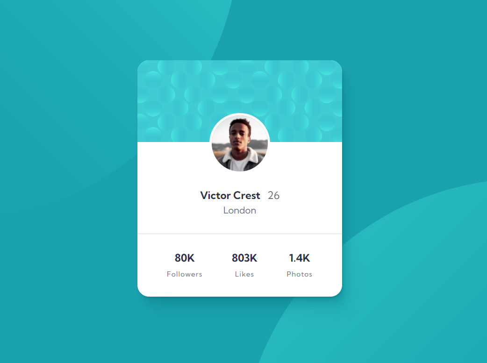

# Welcome! 👋

**"Thanks for checking out this front-end coding challenge."**

# Frontend Mentor - Profile card component solution

- Implemented with pure HTML & Css.

## Table of contents

- [Overview](#overview)
  - [The challenge](#the-challenge)
  - [Screenshot](#screenshot)
  - [Links](#links)
- [My process](#my-process)
  - [Built with](#built-with)
  - [What I learned](#what-i-learned)
  - [Continued development](#continued-development)
  - [Useful resources](#useful-resources)
- [Author](#author)
- [Acknowledgments](#acknowledgments)

## Overview

### The challenge

The challenge is to build out this Profile card component and get it looking as close to the design as possible.

### Screenshot

### Links

- Solution URL: [Click to check my solution at Frontend Mentor](https://www.frontendmentor.io/solutions/looks-simple-but-have-some-tricky-parts-in-this-challenge-HQqUsWzjTV)
- Live Site URL: [Click to check the live site](https://cgm-thanhtike.github.io/Profile-card-component/)

## My process

- The design looks simple but I think it's pretty tricky to get the background (but I finally got it)

### Built with

- Semantic HTML5 markup
- CSS custom properties
- Flexbox
- CSS Grid

### What I learned

I learned about layout algorithms article lately and used in this project. 
I was struggled to achieve the background svg images and learned about it by doing this project.

## Author

- Website - [My git-hub profile](https://github.com/CGM-ThanHtike)
- Frontend Mentor - [My Frontend Mentor profile](https://www.frontendmentor.io/profile/CGM-ThanHtike)

**Thank you all!** 🚀